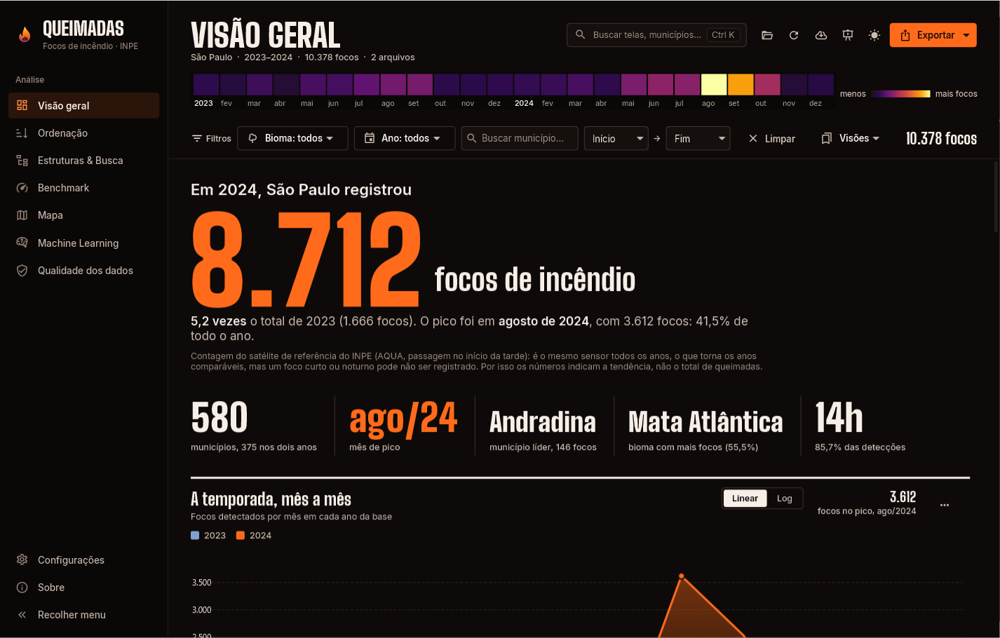
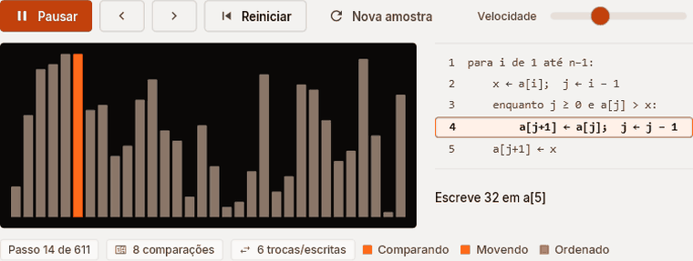
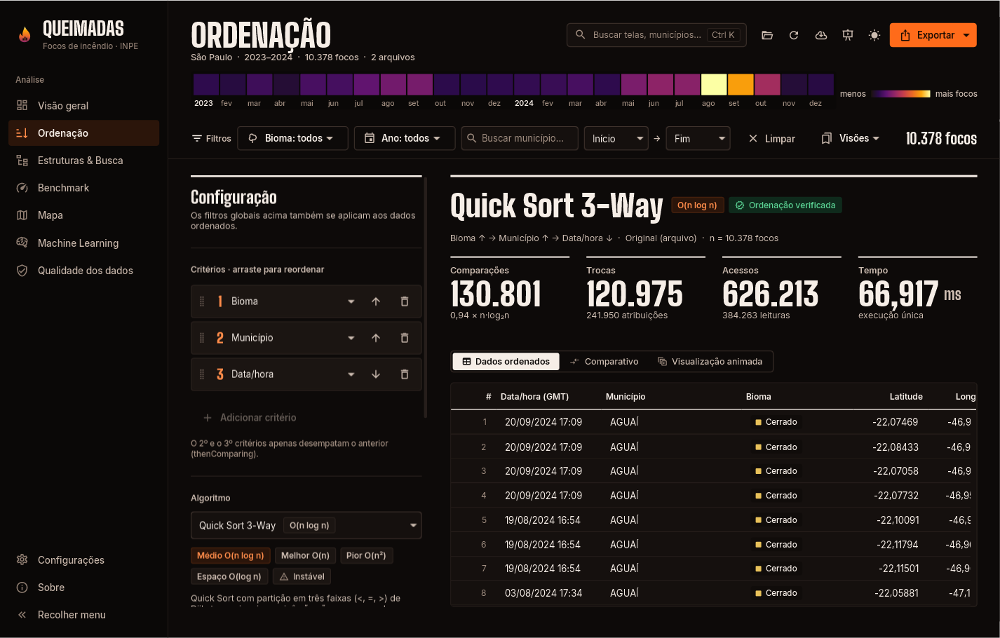
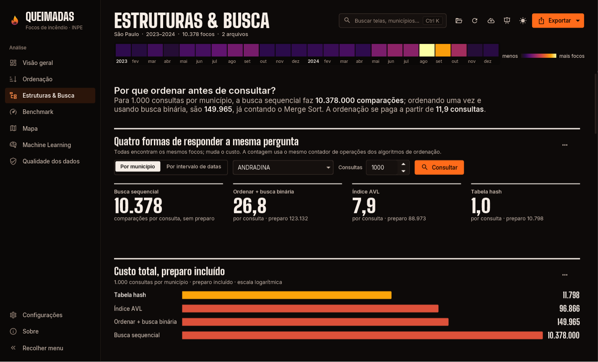
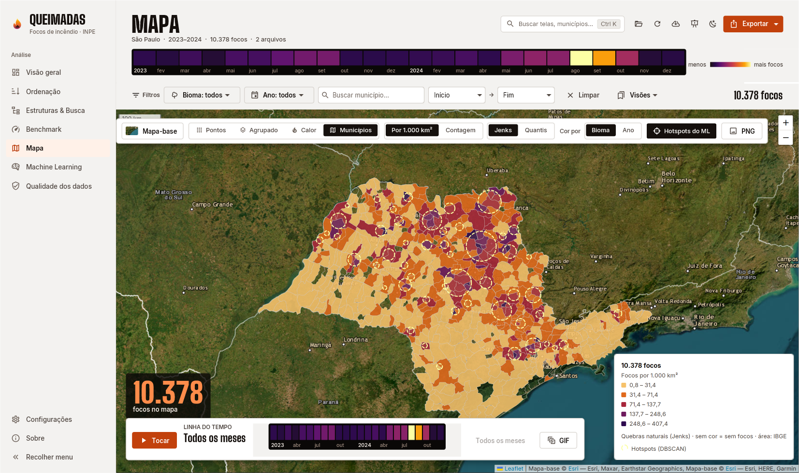
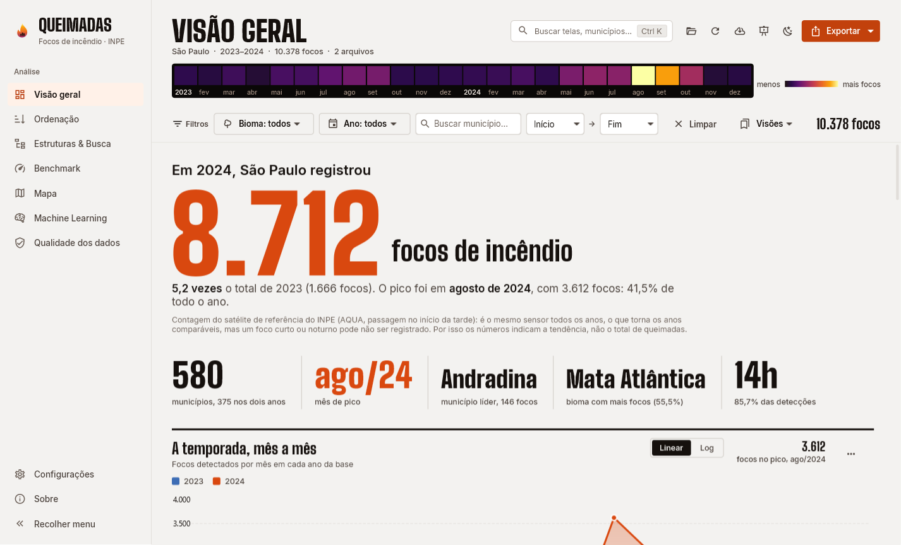

# APS Queimadas

[](https://github.com/gustavoblopes79/aps-queimadas/actions/workflows/ci.yml)
[](https://github.com/gustavoblopes79/aps-queimadas/releases/latest)
[](https://gustavoblopes79.github.io/aps-queimadas/)


[](LICENSE)

**Treze algoritmos de ordenação feitos à mão contra os 10.378 focos de incêndio que o INPE detectou em São Paulo em 2023 e 2024.** O sistema lê e limpa os dados, ordena por data, bioma e município contando cada comparação, mede os algoritmos com rigor, busca e indexa com estruturas próprias, mapeia os focos e tenta prever os próximos meses.

APS de **Estrutura de Dados** · Ciência da Computação · UNIP. Tema: *Desenvolvimento de um Sistema para Análise de Performance de Algoritmos de Ordenação de Dados.*



**[Baixar](https://github.com/gustavoblopes79/aps-queimadas/releases/latest)** · **[Site do projeto](https://gustavoblopes79.github.io/aps-queimadas/)** · **[Manual](docs/MANUAL.md)** · **[Javadoc](https://gustavoblopes79.github.io/aps-queimadas/javadoc/)** · **[Perguntas da banca](docs/BANCA.md)**



---

## Em números

| Tema | Número | Fonte |
|---|---:|---|
| Focos de SP na base (2023 + 2024, após limpeza) | 10.378 | `data/raw`, [DADOS.md](docs/DADOS.md) |
| Focos em 2024 × 2023 | 8.712 × 1.666 (5,2 vezes) | Visão geral |
| Pico do período | agosto de 2024: 3.612 focos (41,5% do ano) | Visão geral |
| Algoritmos de ordenação implementados à mão | 13 | [ALGORITMOS.md](docs/ALGORITMOS.md) |
| Ordenar a base inteira (bioma → município → data) | Merge Sort: 122.682 comparações · Bubble Sort: 53.786.078 | [resultados/saida-console.txt](docs/resultados/saida-console.txt) |
| Expoente empírico das comparações (cenário aleatório) | O(n²): k ≈ 2,0 · O(n log n): k = 1,02 a 1,18 | [BENCHMARK.md](docs/BENCHMARK.md) |
| Medições do benchmark verificadas como ordenadas | 510 de 510 | [resultados/benchmark.csv](docs/resultados/benchmark.csv) |
| Benchmark próprio × JMH | ordem dos algoritmos com Spearman 0,80; `Arrays.sort` do Java: 106.535 comparações | [resultados/jmh.md](docs/resultados/jmh.md) |
| Encontrar um município (1.000 consultas) | sequencial: 10.378 comparações por consulta · hash: 1,0 | [resultados/estruturas.md](docs/resultados/estruturas.md) |
| Focos a até 25 km de Andradina | árvore k-d: 323 distâncias calculadas contra 10.378 (96,9% a menos) | [resultados/estruturas.md](docs/resultados/estruturas.md) |
| O fogo pula para o vizinho? | 18,1% com vizinho em chamas × 8,2% sem (2,2 vezes) | [resultados/estruturas.md](docs/resultados/estruturas.md) |
| Previsão de focos por município e mês em 2024 (erro médio) | Random Forest 1,355 × previsão sazonal ingênua 1,196 | [resultados/ml-estudo.md](docs/resultados/ml-estudo.md) |
| Testes automatizados | 307 (incluindo 5 de interação com a interface) | [QUALIDADE.md](docs/QUALIDADE.md) |
| Cobertura de linhas | 73,3% | JaCoCo |
| Mutantes mortos (PIT) | 69,9% no total · 81,8% nos algoritmos | [QUALIDADE.md](docs/QUALIDADE.md) |

Todos os valores vêm de execuções reais gravadas em [`docs/resultados`](docs/resultados/). Nenhum foi digitado à mão.

---

## Como rodar

**No celular:** abra a [versão web](https://gustavoblopes79.github.io/aps-queimadas/app/): mapa mês a mês, ranking, ficha e comparação de municípios e o custo real dos 13 algoritmos. Dá para instalar como app, e ela funciona sem internet.

**No computador, sem instalar nada:** baixe o pacote da [última versão](https://github.com/gustavoblopes79/aps-queimadas/releases/latest). Os pacotes trazem o próprio Java.

| Sistema | Pacote |
|---|---|
| Windows | `APS-Queimadas-2.2.0-windows-portatil.zip`: descompacte e abra `APS Queimadas.exe` |
| Linux | `.deb` (Ubuntu, Debian) |
| macOS | `.dmg` |
| Qualquer um com Java 21 | `aps-queimadas-2.2.0-all.jar`: `java -jar aps-queimadas-2.2.0-all.jar` |

**A partir do código** (JDK 21; o Maven vem junto pelo wrapper):

```bash
git clone https://github.com/gustavoblopes79/aps-queimadas.git
cd aps-queimadas
./mvnw javafx:run
```

| Tarefa | Windows | Linux / macOS |
|---|---|---|
| Compilar, testar e verificar a qualidade | `mvnw.cmd clean verify` | `./mvnw clean verify` |
| Abrir o painel | `mvnw.cmd javafx:run` | `./mvnw javafx:run` |
| Menu no terminal | `mvnw.cmd -q exec:java -Dexec.args="cli"` | `./mvnw -q exec:java -Dexec.args="cli"` |
| Gerar o JAR executável | `mvnw.cmd -DskipTests package` | `./mvnw -DskipTests package` |

O programa funciona **sem internet**: os CSVs do INPE, a malha municipal do IBGE, o contorno dos países (Natural Earth), o mapa (Leaflet) e os resultados do benchmark vêm dentro do JAR. No IntelliJ, as configurações de execução já estão na pasta `.run/`.

---

## Enunciado × onde está

| Requisito | Onde está |
|---|---|
| Dados de um estado, 2023 e 2024, CSV do INPE | `data/raw/` · [DADOS.md](docs/DADOS.md) |
| Ordenar e exibir por **data, bioma e município** | Tela **Ordenação**, `cli`, modo `ordenar` · `sorting/CriterioOrdenacao` |
| Informar o **número de operações** | Placar com comparações, trocas, atribuições, acessos e tempo (`InstrumentedArray`, `OperationCounter`) |
| Tratamento de erros | Exceções próprias, linhas rejeitadas com motivo, diálogos amigáveis, logs · [ARQUITETURA §7](docs/ARQUITETURA.md#7-tratamento-de-erros) |
| Funções extras | 10 algoritmos além dos 3 básicos, pseudocódigo passo a passo, multicritério, cenários, estruturas de dados (AVL, hash, heap, Trie, árvore k-d, grafo), mapa, ML, histórico 2019–2024, modo offline, acessibilidade |
| Relatórios | PDF com capa, sumário e gráficos vetoriais; Excel com gráficos nativos; CSV; **relatório com as linhas de código** |
| Benchmark | Tela **Benchmark**, modo `benchmark` · [BENCHMARK.md](docs/BENCHMARK.md) |
| ML | Random Forest com validação no tempo, classificação, DBSCAN/K-Means · [ML.md](docs/ML.md) |
| Dashboard | JavaFX com 9 telas, temas claro e escuro · [DESIGN.md](docs/DESIGN.md) |
| Modelagem documentada | UML, padrões de projeto, ADRs, Javadoc · [ARQUITETURA.md](docs/ARQUITETURA.md), [adr/](docs/adr/) |

---

## Interface

Visual de reportagem de dados ("Boletim de Fogo"): manchete com os números da temporada, faixa térmica clicável com os 24 meses, placar de operações, mapa em tela cheia (com linha do tempo que toca os meses, ficha de cada município e exportação em PNG) e escala de calor "inferno". Em Configurações há modo daltônico (paleta Okabe-Ito, também no mapa), alto contraste e texto ampliado.

| | |
|---|---|
|  |  |
|  |  |

| Atalho | Ação |
|---|---|
| Ctrl+K | Paleta de comandos: telas, ações, algoritmos e municípios |
| Ctrl+1…7 | Visão geral, Ordenação, Estruturas, Benchmark, Mapa, ML, Qualidade |
| F5 | Modo apresentação (setas navegam, Esc sai) |
| Ctrl+O · Ctrl+R · Ctrl+E | Abrir CSV · Recarregar · Exportar |
| Ctrl+T · Ctrl+B · F1 | Tema · Recolher o menu · Sobre |

Todos os prints estão em [`docs/prints/`](docs/prints/) (páginas inteiras em `completa/`); o modo `capturas` os regenera.

---

## Modos de linha de comando

`java -jar aps-queimadas-2.2.0-all.jar <modo> [opções]`

| Modo | O que faz |
|---|---|
| *(nenhum)* | Painel JavaFX |
| `cli` | Menu interativo no terminal |
| `ordenar --criterios bioma,municipio,data:desc --algoritmo quick --n 0 --cenario original` | Ordena e exibe, com as operações |
| `comparar --criterios municipio --cenario aleatorio` | Todos os algoritmos sobre a mesma entrada |
| `benchmark [--rapido]` | Bateria completa; grava CSV, Excel e PDF em `relatorios/` |
| `resultados [--rapido]` | Comparativo + benchmark + ML + relatórios (os números da dissertação) |
| `estruturas [--brasil 2019-2024]` | Buscas, AVL, hash, heap, memória, Merge Sort paralelo e External Merge Sort |
| `ml` · `ml-estudo` | Previsão, classificação e hotspots · estudo com validação em janelas e ablação |
| `historico --anos 2019-2024 [--meteorologia]` | Baixa o histórico de SP |
| `baixar --uf SP --anos 2023,2024` | Baixa os CSVs do INPE |
| `relatorio-codigo` | `relatorios/codigo-fonte.pdf` com as linhas de código |
| `manual` | `docs/MANUAL.pdf` a partir de `docs/MANUAL.md` |
| `agregados` | Resume o histórico de SP e os estados do Brasil nos CSVs embarcados |
| `capturas [--saida docs/prints]` | Captura todas as telas nos dois temas |
| `web [--saida site/app]` | Roda os 13 algoritmos na base real e grava os dados da versão web |

---

## Algoritmos

| Algoritmo | Melhor | Médio | Pior | Espaço | Estável |
|---|---|---|---|---|---|
| Bubble Sort | O(n) | O(n²) | O(n²) | O(1) | ✔ |
| Selection Sort | O(n²) | O(n²) | O(n²) | O(1) | ✘ |
| Insertion Sort | O(n) | O(n²) | O(n²) | O(1) | ✔ |
| Shell Sort (Ciura) | O(n log n) | ~O(n^1,25) | O(n^1,5) | O(1) | ✘ |
| Merge Sort | O(n)* | O(n log n) | O(n log n) | O(n) | ✔ |
| Quick Sort (mediana de 3, Hoare) | O(n log n) | O(n log n) | O(n²) | O(log n) | ✘ |
| Quick Sort 3-Way (Dijkstra) | O(n) | O(n log n) | O(n²) | O(log n) | ✘ |
| Quick Sort 2 pivôs (Yaroslavskiy) | O(n log n) | O(n log n) | O(n²) | O(log n) | ✘ |
| Intro Sort (Musser) | O(n log n) | O(n log n) | O(n log n) | O(log n) | ✘ |
| Heap Sort | O(n log n) | O(n log n) | O(n log n) | O(1) | ✘ |
| Tim Sort (simplificado) | O(n) | O(n log n) | O(n log n) | O(n) | ✔ |
| Radix Sort LSD (0 comparações) | O(d·n) | O(d·n) | O(d·n) | O(n+b) | ✔ |
| Counting Sort (0 comparações, intervalo pequeno) | O(n+k) | O(n+k) | O(n+k) | O(n+k) | ✔ |

Detalhes, modelo de custo e como adicionar um algoritmo: [ALGORITMOS.md](docs/ALGORITMOS.md). Estruturas de dados e busca: [ESTRUTURAS.md](docs/ESTRUTURAS.md).

---

## Arquitetura e qualidade

- **Padrões:** Strategy e Factory (algoritmos), Decorator e Observer (`InstrumentedArray`), MVC (JavaFX), Facade e Adapter (ML), Builder, Command (paleta) e Memento (visões salvas).
- **Regras garantidas pelo build:** nenhuma ordenação pronta em produção (`ArquiteturaTest` e Checkstyle), estruturas de busca sem coleções prontas, cobertura mínima.
- **Cada `./mvnw verify` roda:** 335 testes, Checkstyle, PMD, SpotBugs e JaCoCo (≥ 65% no total, ≥ 85% nos pacotes centrais). Teste de mutação com PIT no perfil `mutacao`.
- **CI/CD:** GitHub Actions para build a cada push, instaladores a cada tag `v*` e o site com o Javadoc no GitHub Pages.

UML, camadas e fluxos: [ARQUITETURA.md](docs/ARQUITETURA.md). Decisões: [docs/adr](docs/adr/). Qualidade e revisão de segurança: [QUALIDADE.md](docs/QUALIDADE.md).

---

## Documentação

| Documento | Conteúdo |
|---|---|
| [DADOS.md](docs/DADOS.md) | Origem, colunas, limpeza, modo offline e viés do sensor |
| [ARQUITETURA.md](docs/ARQUITETURA.md) | Camadas, estrutura, UML, padrões e tratamento de erros |
| [MANUAL.md](docs/MANUAL.md) · [PDF](docs/MANUAL.pdf) | Manual do usuário: cada tela, atalhos, acessibilidade e problemas comuns |
| [ALGORITMOS.md](docs/ALGORITMOS.md) | Os 13 algoritmos, critérios e modelo de custo |
| [ESTRUTURAS.md](docs/ESTRUTURAS.md) | Busca binária, AVL, hash, heap, Trie, árvore k-d, grafo, External e Parallel Merge Sort |
| [BENCHMARK.md](docs/BENCHMARK.md) | Metodologia na JVM, resultados e validação com JMH |
| [ML.md](docs/ML.md) | Modelos, validação temporal, ablação e limites |
| [DESIGN.md](docs/DESIGN.md) | Design system, UX, acessibilidade e texto para a dissertação |
| [QUALIDADE.md](docs/QUALIDADE.md) | Verificações do build, mutação e revisão de segurança |
| [BANCA.md](docs/BANCA.md) | Perguntas prováveis da banca e onde está cada resposta |
| [adr/](docs/adr/) | Registros de decisões de arquitetura |
| [resultados/](docs/resultados/) | Saídas reais usadas na dissertação |
| [GRUPO.md](docs/GRUPO.md) · [ENTREGA.md](docs/ENTREGA.md) | Capa e integrantes · checklist de entrega |
| [CHANGELOG.md](CHANGELOG.md) · [CONTRIBUTING.md](CONTRIBUTING.md) | Novidades de cada versão · como contribuir |

---

## Tecnologias e créditos

| Área | Tecnologias |
|---|---|
| Plataforma | Java 21, Maven (+ Wrapper), Shade, jpackage + jlink |
| Interface | JavaFX 21, [AtlantaFX](https://github.com/mkpaz/atlantafx), [Ikonli](https://kordamp.org/ikonli/), fontes [Inter](https://rsms.me/inter/) e [Big Shoulders Display](https://github.com/xotypeco/big_shoulders) (OFL) |
| Mapa | Leaflet 1.9 + markercluster, malha municipal do IBGE, países do Natural Earth, mapas-base Esri e © colaboradores do OpenStreetMap |
| ML | [Smile](https://haifengl.github.io/) 4.4 |
| Relatórios | Apache POI, OpenPDF |
| Qualidade | JUnit 5, TestFX + Monocle, JaCoCo, Checkstyle, PMD, SpotBugs, PIT, JMH |
| Dados | **INPE, Programa Queimadas** (satélite de referência) · [dataserver-coids.inpe.br](https://dataserver-coids.inpe.br/queimadas/queimadas/focos/csv/anual/EstadosBr_sat_ref/) |

**Licença:** o código deste projeto é MIT. O JAR e os instaladores incluem o Smile (GPL v3), então a distribuição binária completa segue a GPL v3; detalhes em [LICENSE](LICENSE).
