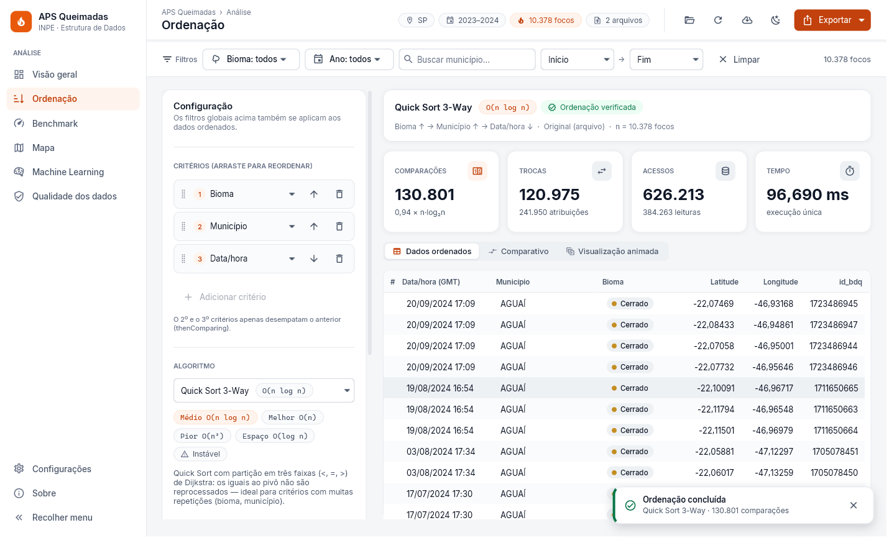
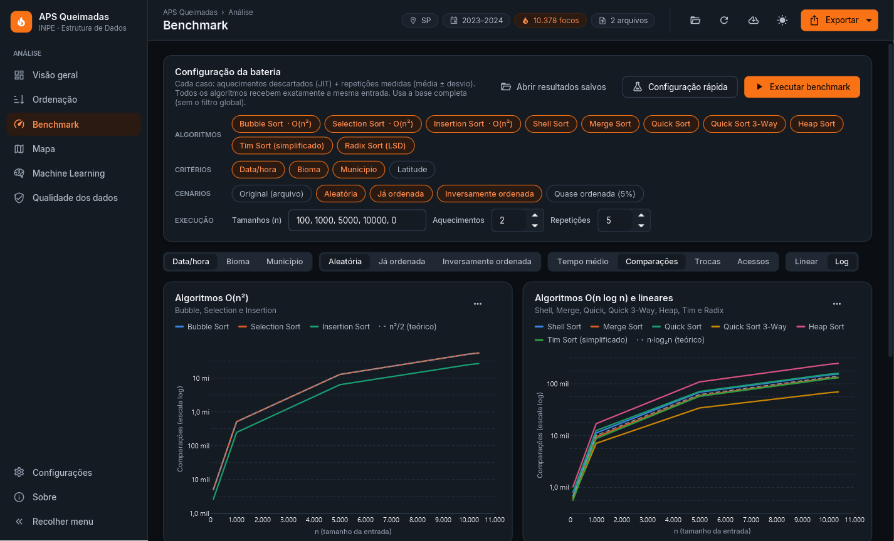
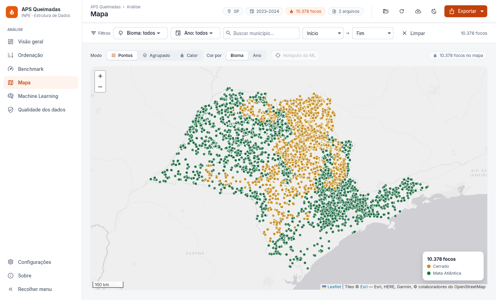
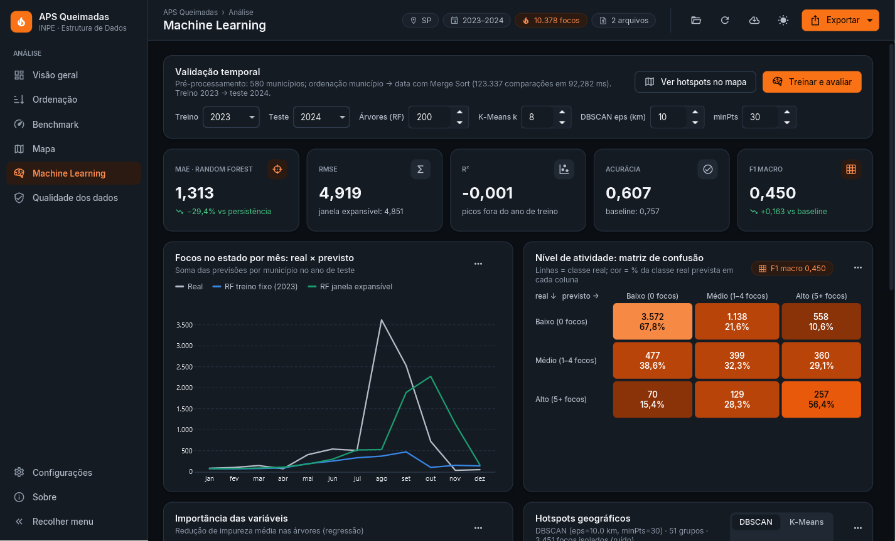

# APS Queimadas — Análise de Performance de Algoritmos de Ordenação

[](https://github.com/UMOBUGA/aps-queimadas/actions/workflows/ci.yml)


**APS — Atividades Práticas Supervisionadas · Ciência da Computação · UNIP · Estrutura de Dados**

**Tema:** *Desenvolvimento de um Sistema para Análise de Performance de Algoritmos de Ordenação de Dados.* A aplicação é o geoprocessamento dos **focos de incêndio detectados por satélite** (INPE) no estado de **São Paulo, em 2023 e 2024**.

O sistema lê, valida e limpa os CSVs do INPE e ordena os 10.378 focos por **data, bioma, município** (e mais 8 critérios, com multicritério). São **10 algoritmos implementados à mão**, e a cada exibição o sistema informa **comparações, trocas, atribuições, acessos ao array e tempo**.

Além da ordenação, o sistema:

- executa um **benchmark** com metodologia adequada à JVM;
- estima empiricamente a complexidade;
- aplica **Machine Learning** (Random Forest e DBSCAN/K-Means) sobre os dados ordenados;
- apresenta tudo em um **dashboard JavaFX** com design system próprio (temas claro e escuro), mapa Leaflet e relatórios Excel/PDF.


> Grupo, RAs e dados da capa: [`docs/GRUPO.md`](docs/GRUPO.md) (a preencher).

---

## Sumário

1. [Início rápido](#início-rápido)
2. [Funcionalidades × enunciado](#funcionalidades--enunciado)
3. [Interface](#interface)
4. [Modos de execução](#modos-de-execução)
5. [Algoritmos](#algoritmos)
6. [Arquitetura](#arquitetura)
7. [Testes e qualidade](#testes-e-qualidade)
8. [Documentação](#documentação)
9. [Tecnologias e créditos](#tecnologias-e-créditos)

---

## Início rápido

**Pré-requisitos:**

- **JDK 21.** No IntelliJ: *File → Project Structure → SDK → Download JDK → 21 (Temurin)*.
- **Maven** não precisa ser instalado: o projeto traz o **Maven Wrapper** (`mvnw`).
- **Internet** é necessária apenas no primeiro build (dependências) e para o mapa.

```bash
git clone https://github.com/UMOBUGA/aps-queimadas.git
cd aps-queimadas
```

| Tarefa | Windows | Linux / macOS |
|---|---|---|
| Compilar + 199 testes + cobertura | `mvnw.cmd clean verify` | `./mvnw clean verify` |
| Abrir o **dashboard** | `mvnw.cmd javafx:run` | `./mvnw javafx:run` |
| Menu no terminal | `mvnw.cmd -q exec:java -Dexec.args="cli"` | `./mvnw -q exec:java -Dexec.args="cli"` |
| Gerar o **JAR executável** | `mvnw.cmd -DskipTests package` | `./mvnw -DskipTests package` |

O JAR gerado, `target/aps-queimadas-1.0.0-all.jar`, contém todas as dependências. Para rodar:

```bash
java -jar target/aps-queimadas-1.0.0-all.jar
```

Sem argumentos, abre o dashboard. Os modos de linha de comando estão abaixo.

**No IntelliJ**, as configurações de execução já vêm prontas (pasta `.run/`):

- *Dashboard (javafx:run)*
- *Dashboard (Main)*
- *Console (menu)*
- *Resultados (benchmark + ML)*
- *Relatório de código*
- *Todos os testes*

Os **dados reais** de SP 2023/2024 já estão em `data/raw/`. Para outro estado ou ano, use "Baixar do INPE…" no dashboard ou o modo `baixar`.

---

## Funcionalidades × enunciado

| Requisito do enunciado | Onde está |
|---|---|
| Dados de um estado, 2023 e 2024, CSV do INPE | `data/raw/focos_br_sp_ref_2023.csv` e `…2024.csv` · [docs/DADOS.md](docs/DADOS.md) |
| Ordenar e exibir por **data, bioma e município** | Aba **Ordenação**, `cli` opção 2, modo `ordenar` · critérios em `sorting/CriterioOrdenacao` |
| Informar o **número de operações** a cada exibição | Painel com comparações, trocas, atribuições, acessos e tempo (`OperationCounter`, `InstrumentedArray`) |
| Tratamento de erros | Exceções próprias, rejeição de linhas com motivo, diálogos amigáveis, logs · [ARQUITETURA §7](docs/ARQUITETURA.md#7-tratamento-de-erros) |
| Funções extras | 7 algoritmos além dos 3 básicos, multicritério, cenários de entrada, cancelamento, download do INPE, verificação de ordenação |
| Relatórios adicionais | Excel (8 abas), PDF com gráficos, CSV, relatório de qualidade dos dados, **relatório com as linhas de código** |
| Benchmark (tamanhos crescentes; aleatório, ordenado e inverso) | Aba **Benchmark**, modo `benchmark` · [docs/BENCHMARK.md](docs/BENCHMARK.md) |
| ML / análise preditiva | Previsão (Random Forest), classificação do nível de atividade, hotspots (DBSCAN/K-Means) · [docs/ML.md](docs/ML.md) |
| Dashboard interativo | JavaFX: Visão geral, Ordenação (com visualização animada), Benchmark, **Mapa** (pontos, agrupado, calor), ML, Qualidade dos dados · [docs/DESIGN.md](docs/DESIGN.md) |
| Modelagem robusta e documentada | UML (Mermaid), padrões de projeto, Javadoc · [docs/ARQUITETURA.md](docs/ARQUITETURA.md) |

---

## Interface

Painel de monitoramento com **sidebar**, barra de filtros global (bioma, ano, município com autocompletar, período) e tema **claro/escuro** (Ctrl+T), persistido entre execuções. O design system (tokens CSS, componentes, paleta validada para daltonismo, contraste WCAG AA) está documentado em [docs/DESIGN.md](docs/DESIGN.md).

| Claro | Escuro |
|---|---|
|  |  |
|  |  |

**Atalhos:**

| Atalho | Ação |
|---|---|
| Ctrl+1…6 | Telas |
| Ctrl+O | Abrir CSV |
| Ctrl+R | Recarregar |
| Ctrl+E | Exportar |
| Ctrl+T | Tema |
| Ctrl+B | Recolher o menu |
| F1 | Sobre |

Todos os prints em [`docs/prints/`](docs/prints/) (páginas inteiras em `completa/`). Para regenerá-los, use o modo `capturas`.

---

## Modos de execução

Uso geral: `java -jar target/aps-queimadas-1.0.0-all.jar <modo> [opções]`. Também funciona com `mvnw -q exec:java -Dexec.args="<modo> …"`.

| Modo | O que faz |
|---|---|
| *(nenhum)* | Dashboard JavaFX |
| `cli` | Menu interativo no terminal (tudo o que o dashboard faz, sem interface gráfica) |
| `ordenar --criterios bioma,municipio,data:desc --algoritmo quick --n 0 --cenario original --linhas 30 [--csv]` | Ordena e exibe, com as operações realizadas |
| `comparar --criterios municipio --cenario aleatorio` | Todos os algoritmos sobre a mesma entrada |
| `benchmark [--rapido]` | Bateria completa; grava CSV, Excel e PDF em `relatorios/` |
| `ml` | Previsão, classificação e hotspots; grava Excel |
| `resultados [--rapido]` | Comparativo + benchmark + ML + relatórios (os números da dissertação) |
| `relatorio-codigo` | `relatorios/codigo-fonte.pdf` e `.txt` |
| `baixar --uf SP --anos 2023,2024` | Baixa e extrai os CSVs do INPE para `data/raw/` |
| `capturas [--saida docs/prints]` | Abre o dashboard, captura todas as telas nos dois temas e fecha |
| `help` | Ajuda |

**Exemplo real:**

```text
$ java -jar aps-queimadas-1.0.0-all.jar comparar --criterios municipio --cenario aleatorio
Algoritmo                Comparacoes  Trocas      Atribuicoes  Acessos      Tempo       Verif.
Bubble Sort               53.736.380  26.626.863   53.253.726  213.980.212     3,013 s  OK
Selection Sort            53.846.253      10.363       20.726  107.733.958     1,511 s  OK
Insertion Sort            26.637.238           0   26.637.217   53.284.832  814,540 ms  OK
Shell Sort                   169.516           0      115.582      384.919   24,603 ms  OK
Merge Sort                   131.708           0      263.632      669.349   17,669 ms  OK
Quick Sort                   160.270      46.687       93.374      371.494   14,837 ms  OK
Quick Sort 3-Way              87.520      76.928      153.856      397.404   11,460 ms  OK
Heap Sort                    245.030     129.053      258.106    1.006.272   14,402 ms  OK
Tim Sort (simplificado)      129.181           0      270.726      671.938   15,832 ms  OK
```

Nesse exemplo, n = 10.378, sem aquecimento do JIT; as medições rigorosas estão em [docs/BENCHMARK.md](docs/BENCHMARK.md). O Radix não aparece porque "município" é texto (ele exige chave numérica).

**Configuração:** `src/main/resources/application.properties`. Para sobrescrever sem recompilar, crie `aps.properties` na pasta de execução ou use `-Daps.chave=valor`.

---

## Algoritmos

| Algoritmo | Melhor | Médio | Pior | Espaço | Estável |
|---|---|---|---|---|---|
| Bubble Sort | O(n) | O(n²) | O(n²) | O(1) | ✔ |
| Selection Sort | O(n²) | O(n²) | O(n²) | O(1) | ✘ |
| Insertion Sort | O(n) | O(n²) | O(n²) | O(1) | ✔ |
| Shell Sort (Ciura) | O(n log n) | ~O(n^1,25) | O(n^1,5) | O(1) | ✘ |
| Merge Sort | O(n)* | O(n log n) | O(n log n) | O(n) | ✔ |
| Quick Sort (mediana de 3, Hoare) | O(n log n) | O(n log n) | O(n²) | O(log n) | ✘ |
| Quick Sort 3-Way (Dijkstra) | O(n) | O(n log n) | O(n²) | O(log n) | ✘ |
| Heap Sort | O(n log n) | O(n log n) | O(n log n) | O(1) | ✘ |
| Tim Sort (simplificado) | O(n) | O(n log n) | O(n log n) | O(n) | ✔ |
| Radix Sort LSD (0 comparações) | O(d·n) | O(d·n) | O(d·n) | O(n+b) | ✔ |

Detalhes, decisões de projeto e modelo de custo: [docs/ALGORITMOS.md](docs/ALGORITMOS.md).

---

## Arquitetura

- **Padrões de projeto:**
  - Strategy (`SortAlgorithm`) e Factory (`SortAlgorithmFactory`);
  - Decorator (`InstrumentedArray`, que conta as operações);
  - MVC (dashboard: FXML + controllers com injeção do `UiContexto`);
  - Facade (`Preditor`), Adapter (`SmileAdapter`) e Builder (`FocoIncendio`).
- **Diagramas UML** (Mermaid, renderizados pelo GitHub): [docs/ARQUITETURA.md](docs/ARQUITETURA.md).

```
br.unip.aps
├── model       FocoIncendio (imutável), BaseDeFocos
├── io          CsvLoader (encoding, separador, limpeza), RelatorioCarga, DownloaderInpe
├── sorting     SortAlgorithm, InstrumentedArray, OperationCounter, critérios, ServicoOrdenacao
│   └── algorithms   10 algoritmos
├── benchmark   BenchmarkRunner (warm-up, repetições, desvio), AnaliseComplexidade (log-log)
├── analysis    Estatisticas, FiltroFocos
├── ml          BaseMensal, PrevisaoFocos, ClassificadorNivel, ClusterizacaoHotspots, Preditor
├── report      ReportExporter (CSV/Excel/PDF), CodigoFonteReport
├── cli · ui    menu de console · dashboard JavaFX
└── app · config · util
```

---

## Testes e qualidade

```bash
./mvnw clean verify     # 199 testes · cobertura em target/site/jacoco/index.html
```

| Suíte | O que garante |
|---|---|
| `SortAlgorithmsTest` (143 casos parametrizados) | Todo algoritmo × {vazio, 1 elemento, repetidos, negativos, ordenado, inverso, aleatório}. Resultado igual ao `Collections.sort` (permitido só nos testes); estabilidade conforme a ficha; nulos; multicritério; Quick Sort com 200 mil ordenados; cancelamento |
| `OperationCounterTest` | Contagens teóricas exatas (Bubble n−1 / n(n−1)/2, Selection n(n−1)/2…) |
| `CsvLoaderTest` | UTF-8 com BOM, Latin-1, `;`, vírgula decimal, `-999`, linhas inválidas, deduplicação, erros amigáveis |
| `ArquiteturaTest` | **Falha o build** se o código de produção usar `Collections.sort`, `Arrays.sort`, `List.sort`, `sorted()`, `TreeMap`/`TreeSet` |
| `DadosReaisTest` | Base real do INPE: 10.378 focos; todos os algoritmos × data/bioma/município |
| `BenchmarkRunnerTest`, `PreditorTest`, `ReportExporterTest`, `EstatisticasTest`, `CriteriosTest` | Benchmark e expoente empírico, ML, relatórios, estatísticas, colação pt-BR |
| `DashboardSmokeTest` | Monta o shell, navega pelas 8 telas nos dois temas e aplica um filtro global (ignorado em CI sem interface gráfica) |
| `OuvinteArrayTest` | O ouvinte da visualização animada não altera o resultado nem a contagem, e os eventos reconstroem a ordenação |

O **CI** (GitHub Actions) roda o build e os testes a cada push e publica o JAR, a cobertura e o `codigo-fonte.pdf` como artefatos.

---

## Documentação

| Documento | Conteúdo |
|---|---|
| [docs/DADOS.md](docs/DADOS.md) | Fase 1: como obter os dados, colunas reais, perfil de SP e plano de limpeza |
| [docs/ARQUITETURA.md](docs/ARQUITETURA.md) | Fase 2: camadas, estrutura Maven, UML de classes e de sequência, padrões, tratamento de erros |
| [docs/ALGORITMOS.md](docs/ALGORITMOS.md) | Fase 3: algoritmos, critérios, modelo de custo, decisões (pivô, estabilidade, Collator) |
| [docs/BENCHMARK.md](docs/BENCHMARK.md) | Fase 4: metodologia JVM e resultados reais |
| [docs/ML.md](docs/ML.md) | Fase 5: modelos, validação, resultados, Deep Learning (fundamentação) |
| [docs/DESIGN.md](docs/DESIGN.md) | Design system, decisões de UX, acessibilidade, texto para a dissertação e prints recomendados |
| [docs/resultados/](docs/resultados/) | Saídas reais (CSV/Excel/PDF) usadas na dissertação |
| [docs/GRUPO.md](docs/GRUPO.md) | Capa, integrantes e ficha de APS (a preencher) |
| [docs/ENTREGA.md](docs/ENTREGA.md) | Próximas fases (dissertação, apresentação) e checklist de entrega |
| Javadoc | `./mvnw javadoc:javadoc` → `target/site/apidocs/index.html` |

---

## Tecnologias e créditos

| Área | Tecnologias |
|---|---|
| Plataforma e build | Java 21 (LTS), Maven (+ Wrapper), Shade (fat JAR), JaCoCo, GitHub Actions |
| Interface | JavaFX 21 (FXML, CSS, Charts, WebView), [AtlantaFX](https://github.com/mkpaz/atlantafx) 2.1, [Ikonli](https://kordamp.org/ikonli/) (Material Design Icons), fonte [Inter](https://rsms.me/inter/) (OFL) |
| Mapa | Leaflet 1.9 + markercluster, mapas-base Esri World Light/Dark Gray Canvas, dados © colaboradores do OpenStreetMap |
| Machine Learning | [Smile](https://haifengl.github.io/) 4.4 (Random Forest, K-Means, DBSCAN) |
| Relatórios | Apache POI (Excel), OpenPDF (PDF) |
| Testes e logs | JUnit 5; `java.util.logging` (+ ponte SLF4J/Log4j) |
| Dados | **INPE — Programa Queimadas**, focos do satélite de referência, [dataserver-coids.inpe.br](https://dataserver-coids.inpe.br/queimadas/queimadas/focos/csv/anual/EstadosBr_sat_ref/) |

**Licença do Smile.** O Smile é distribuído sob a GNU GPL v3. Isso não afeta este trabalho acadêmico. Se o JAR for redistribuído publicamente, deve acompanhar as licenças das dependências.
