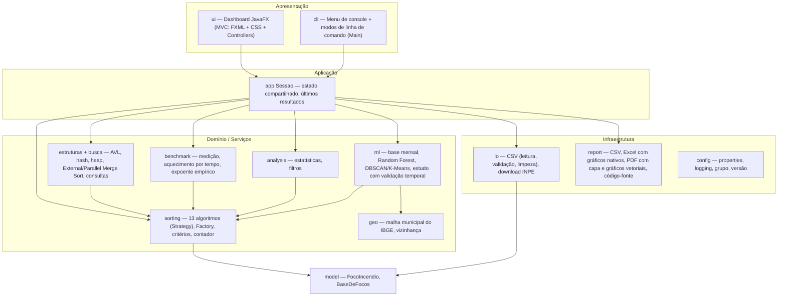
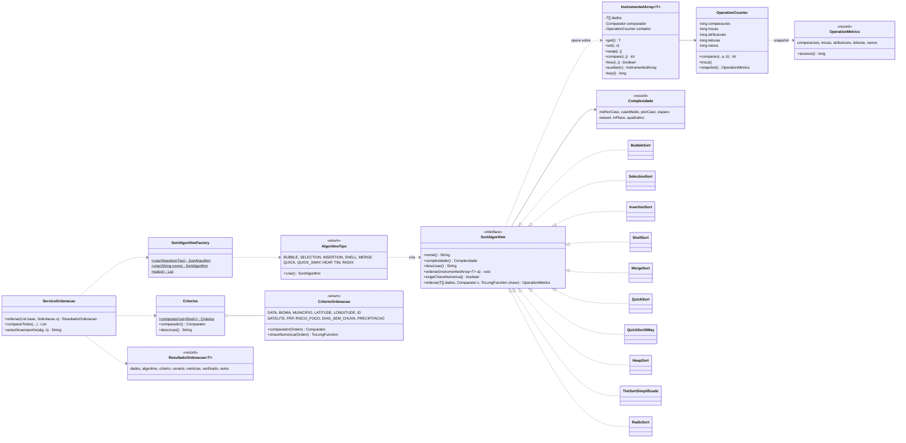
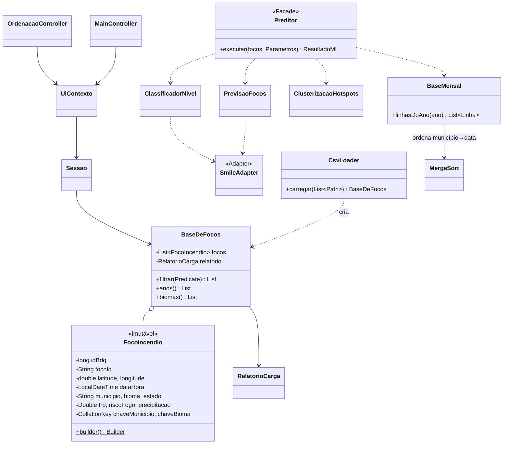
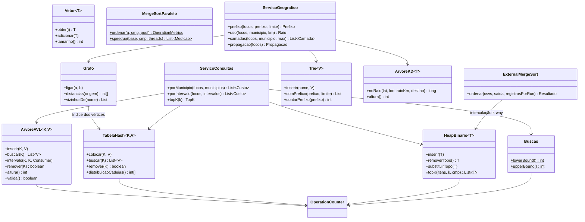

# Fase 2 — Arquitetura do sistema

## 1. Visão em camadas



## 2. Estrutura do projeto Maven

```
aps-queimadas/
├── pom.xml                         Java 21, JavaFX 21, Smile 4.4, POI, OpenPDF, JUnit 5, JaCoCo, Checkstyle, PMD,
│                                   SpotBugs, Shade; perfis jmh (JMH) e mutacao (PIT)
├── mvnw / mvnw.cmd / .mvn/         Maven Wrapper (não precisa instalar Maven)
├── config/                         regras do Checkstyle, PMD e exclusões justificadas do SpotBugs
├── data/raw/                       CSVs do INPE (SP 2023 e 2024)
├── docs/                           documentação técnica, ADRs (docs/adr) e resultados reais (docs/resultados)
├── site/                           página do projeto (GitHub Pages) + Javadoc publicado em /javadoc
├── .github/workflows/              ci.yml (build + verificações), release.yml (instaladores), pages.yml (site)
├── .run/                           configurações de execução do IntelliJ
└── src/
    ├── main/java/br/unip/aps/
    │   ├── Main.java               ponto de entrada (dashboard, cli, benchmark, ml, resultados, estruturas…)
    │   ├── ApsException.java       exceção base (mensagens amigáveis)
    │   ├── app/                    Sessao, ExperimentosEstruturas, RelatorioEstudoMl, Agregados
    │   ├── model/                  FocoIncendio (registro imutável + Builder), BaseDeFocos
    │   ├── io/                     CsvLoader, CsvParser, RelatorioCarga, RepositorioDados (dados embarcados),
    │   │                           DownloaderInpe, DataValidationException
    │   ├── sorting/                SortAlgorithm, InstrumentedArray, OperationCounter, OperationMetrics,
    │   │   │                       AlgoritmoTipo, SortAlgorithmFactory, CriterioOrdenacao, Criterios,
    │   │   │                       Ordem, CenarioEntrada, ServicoOrdenacao, ResultadoOrdenacao, Ordenacoes
    │   │   └── algorithms/         Bubble, Selection, Insertion, Shell, Merge, Quick, Quick3Way, DualPivotQuick,
    │   │                           Intro, Heap, TimSortSimplificado, Radix, Counting (+ Intercalacao)
    │   ├── estruturas/             Vetor, ArvoreAVL, TabelaHash, HeapBinario, Trie, ArvoreKD, Grafo,
    │   │                           ExternalMergeSort, MergeSortParalelo, MedidorMemoria
    │   ├── busca/                  Buscas (lower/upper bound), ServicoConsultas, ServicoGeografico
    │   ├── benchmark/              BenchmarkConfig, BenchmarkRunner, BenchmarkResult, AnaliseComplexidade
    │   ├── analysis/               Estatisticas, FiltroFocos, Contagem, EstatisticaDescritiva, Classificacao (Jenks)
    │   ├── geo/                    MalhaMunicipal, Vizinhanca
    │   ├── ml/                     BaseMensal, PrevisaoFocos, ClassificadorNivel, ClusterizacaoHotspots, Metricas,
    │   │                           NivelAtividade, SmileAdapter, Preditor (fachada), EstudoPrevisao, MeteoMensal
    │   ├── report/                 ReportExporter, RelatorioPdf, GraficosPdf, Identidade, ContextoRelatorio,
    │   │                           CodigoFonteReport, ManualPdf
    │   ├── cli/                    MenuConsole, ConsoleIO, TabelaConsole
    │   ├── ui/                     DashboardApp, UiContexto, MainController, Pagina, FiltroGlobal, controllers
    │   │   │                       das 9 telas, ModoApresentacao, TourGuiado, EstudoMlPainel, EstruturasEspaciaisPainel,
    │   │   │                       CapturaTelas
    │   │   ├── componentes/        KpiCard, ChartCard, FaixaTermica, FilterBar, PaletaComandos, Movimento, Logo,
    │   │   │                       ArvoreVisual, SortVisualizer, Pseudocodigo, DonutChart, Toast… (ver DESIGN.md)
    │   │   └── tema/               GerenciadorTema (claro/escuro, densidade, daltonismo, alto contraste, tamanho do texto)
    │   ├── config/                 AppConfig, LogConfig, Grupo, Versao
    │   └── util/                   Textos (Collator pt-BR, nomes próprios), Formatos, Json
    ├── main/resources/             application.properties, logging.properties, grupo.properties, fontes,
    │   │                           dados/ (CSVs embarcados, histórico de SP e estados do Brasil), geo/ (malha do IBGE),
    │   │                           resultados/ (benchmark e ML)
    │   └── br/unip/aps/ui/         main.fxml + 9 telas FXML, css/ (tokens, temas, componentes, gráficos, acessibilidade/),
    │                               mapa.html e web/ (Leaflet local)
    ├── jmh/java/                   benchmarks JMH (perfil jmh)
    └── test/java/br/unip/aps/      testes JUnit 5 (ver QUALIDADE.md)
```

## 3. Diagrama de classes — núcleo de ordenação



## 4. Diagrama de classes — dados, ML e dashboard



## 4.1 Diagrama de classes — estruturas de dados e busca



As estruturas contam comparações no mesmo `OperationCounter` dos algoritmos de ordenação, o que permite comparar busca linear, binária, AVL e hash pelo número de operações. Detalhes e resultados em [ESTRUTURAS.md](ESTRUTURAS.md); a decisão está no [ADR 0005](adr/0005-estruturas-a-mao.md).

## 5. Fluxo de uma "solicitação de exibição ordenada"

```mermaid
sequenceDiagram
    actor U as Usuário
    participant C as OrdenacaoController
    participant X as UiContexto (Task)
    participant S as ServicoOrdenacao
    participant F as SortAlgorithmFactory
    participant A as SortAlgorithm
    participant K as OperationCounter
    U->>C: critério(s), algoritmo, n, cenário → "Ordenar"
    C->>C: valida filtros e tamanho; confirma se O(n²) com n grande
    C->>X: executar(tarefa) — fora da thread da interface
    X->>S: ordenar(base, solicitação)
    S->>S: amostra → cenário → cópia em array (original preservado)
    S->>F: criar(tipo)
    F-->>S: estratégia
    S->>A: ordenar(array, comparador, chave)
    loop cada comparação / troca / acesso
        A->>K: contabiliza (e verifica cancelamento)
    end
    A-->>S: OperationMetrics
    S->>S: verificação independente (está ordenado?)
    S-->>X: ResultadoOrdenacao
    X-->>C: na thread FX
    C-->>U: tabela ordenada + comparações, trocas, atribuições, acessos, tempo
```

## 6. Padrões de projeto (para a dissertação)

| Padrão | Onde | Por quê |
|---|---|---|
| **Strategy** | `SortAlgorithm` + 10 implementações | Trocar de algoritmo sem mudar quem o usa; o benchmark itera sobre as estratégias. |
| **Factory** | `SortAlgorithmFactory` / `AlgoritmoTipo` | Centraliza a criação; o console e o dashboard escolhem pelo nome ou tipo. |
| **Decorator** | `InstrumentedArray` | Acrescenta contagem a um array comum sem poluir os algoritmos; impede "esquecer" de contar. |
| **Observer** | `InstrumentedArray.Ouvinte` | Opcional: a visualização animada assiste às comparações, trocas e atribuições sem alterar o algoritmo nem a contagem. |
| **Builder** | `FocoIncendio.Builder`, `ContextoRelatorio` | Muitos campos opcionais, com objeto final imutável. |
| **MVC** | `ui` (FXML = View, Controllers, Sessao/domínio = Model) | Separa a interface da lógica; os controllers recebem dependências por injeção (*controller factory*). |
| **Facade** | `Preditor` | Uma chamada executa todo o pipeline de ML. |
| **Adapter** | `SmileAdapter` | Isola a API do Smile; o domínio não depende da biblioteca. |
| **Observer** | `ObjectProperty` do JavaFX (`baseProperty`, `mlProperty`) | As abas reagem quando a base ou o resultado de ML mudam. |
| **Template/Record** | `record` Java 21 para resultados | Objetos de valor imutáveis, com `equals`/`hashCode` automáticos. |
| **Command** | `PaletaComandos.Comando` | Cada tela, ação, visão e município vira um comando pesquisável (Ctrl+K). |
| **Memento** | Visões salvas (`FilterBar`) | O estado dos filtros é serializado nas preferências e restaurado depois. |

## 7. Tratamento de erros

- **Exceções próprias (verificadas):**
  - `ApsException`: base, com mensagem amigável em português.
  - `DataValidationException`: arquivo ausente, coluna faltando, base vazia.
- **Erros de linha não interrompem a carga.** A linha é rejeitada e registrada no `RelatorioCarga`, com o motivo.
- **Validação de entrada** em todas as camadas:
  - amostra negativa, filtro com data final antes da inicial;
  - Radix com critério de texto, anos de treino e teste invertidos;
  - UF inválida no download.
- **Arquivos** são abertos com `try-with-resources`. O download exige HTTPS e grava com nomes fixos (sem *zip slip*); a leitura do estudo de ML usa filtro de desserialização. Revisão completa em [QUALIDADE.md](QUALIDADE.md).
- **Cancelamento cooperativo:**
  - o `OperationCounter` checa a interrupção da thread a cada 65.536 comparações;
  - o benchmark checa a cada execução.
- **Dashboard:**
  - toda operação demorada roda em `javafx.concurrent.Task`;
  - erros esperados viram diálogos amigáveis;
  - erros inesperados mostram o *stack trace* expansível e são gravados em `logs/aps-0.log` (`java.util.logging`).
